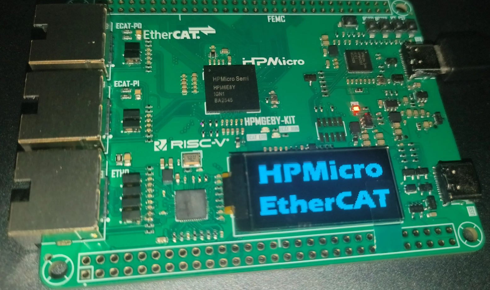

# 概述

主要收集先楫开发者自己基于先楫各类MCU的DIY开源硬件项目，有些可以在本仓库直接下载，有些需要在开发者自身仓库中下载。

# 板子介绍

## HPM6800_PI_V1

主要是基于HPM6800做的派板，可自行参考。文件在本仓库的HPM6800_PI_V1.zip

## HPM6750IVM-EVK

基于hpm6750画的EVK板子，可用HPM6450等替换。文件在本仓库的HPM6750IVM-EVK.zip

## HPM6800-DevKit

基于周立功的HPM6800核心板设计的HMI板子

仓库地址：[hpm68-hmi - 立创开源硬件平台](https://oshwhub.com/hasaki6/hpm68-hmi)

源码地址: https://github.com/starry-m/hpm6800-hmi

## HPM6P41_BB

基于HPM6P41设计的数字电源

仓库地址：[Alipay1/HPM6P41_BB: 以HPM6P41为主控的电源开发板](https://github.com/Alipay1/HPM6P41_BB)

## HSlink
基于HPM5301的DAP调试器
仓库地址：https://github.com/HSLink/HSLink_Hardware

## HPM6360-测试板

基于HPM6360的开发板
仓库地址：[hpm6360-ce-shi-ban - 立创开源硬件平台](https://oshwhub.com/hasaki6/hpm6360-ce-shi-ban)

## HPM5361MiniFOC

基于HPM5361高性能国产RV内核MCU的迷你FOC驱动器
仓库地址：[HPM5361MiniFOC - 立创开源硬件平台](https://oshwhub.com/lx050724/hpm5361foc)
代码链接：https://github.com/LX050724/HPM5361MiniFOC

## HSCanT

- HSCanT 是一款USB转4路CAN FD工具，基于HPM5321芯片设计
  - 支持4路CAN FD通道
  - 每路CAN FD通道支持最高8Mbit/s的数据传输速率
  - 支持上位机配置可选的120Ω终端电阻
  - 每路通道均支持独立的TX、RX状态全彩LED指示
  - 支持最高±58V的过压保护

仓库地址：[HSCanT](https://github.com/HalfSweet/HSCanT)

## HSDevKit5301

- 基于hpm5301设计的开发板

仓库地址：[HSDevKit5301](https://github.com/HalfSweet/HSDevKit5301)

## OSBDM/OSJTAG for Qorivva MPC55xx/56xx
基于 HPM5301 的 OSBDM 调试器，适用于 NXP 和 ST 的 PowerPC 内核单片机。

仓库地址：
https://github.com/zhangjinke/osbdm_hpm5301_hardware
https://github.com/zhangjinke/osbdm_hpm5301_software

## HPM6284Foc

- 基于HPM6284的FOC驱动器

- 仓库地址：[HPM6284Foc](https://github.com/LX050724/HPM6284Foc.git)

## HPM5E31-KIT
- 基于hpm5e31的EtherCAT开发板，板载HSLINK，本板子对应IPB-TINY Board，使用树莓派40PIN引出IO

- 仓库地址：[HPM5E31-KIT](https://oshwhub.com/hasaki6/hpm5e31-kit)

## miniHslink

- 基于HPM5301 迷你版Hslink硬件
- 仓库地址：[miniHslink](https://github.com/KotoriProject/miniHslink)

## LuckyCAT

- LuckyCAT是一款采用先辑半导体 HPM5E31 芯片，支持EtherCAT主从站开发的工业嵌入式开发板，适用于刀片IO、PLC、伺服电机等工业嵌入式应用，主频高达480MHz，能满足复杂的逻辑设计需求，采用全国产化设计，原理图PCB全开源，提供入门资料和视频方便新手快速上手开发

- 仓库地址：
    - github
        - https://github.com/coinlockerbaby/LuckyCAT_HardWare
        - https://github.com/coinlockerbaby/LuckyCAT_SoftWare
    - 立创开源硬件平台：https://oshwhub.com/undefined-innovation/hpmduino_dev

## HPM5E-EC-DEV 先楫Ethercat开发板

- 基于先楫HPM5E31IPB1的Ethercat开发板，将Ethercat P0/P1和千兆以太网接口引出，板载LCD、DS18B20、蜂鸣器、USB OTG、串口、CAN等外设

- 仓库地址：[HPM5E-EC-DEV 先楫Ethercat开发板](https://oshwhub.com/azure2024/hpm5e-ec-dev-public)

## 基于HPM6750的lambda-pi

- 基于HPM6750的开发板，版型参考ART-PI，原理图参考了HPM6750EVK2和HPM6750EVKMINI开发板，板载HSLINK烧录器和多种常用外设，引出74个IO口

- 仓库地址：[基于HPM6750的lambda-pi](https://oshwhub.com/zhaowenbin/lambda-pi)

## 基于HPM5E31的双路EtherCAT高性能高精度FOC驱动板

- 仓库地址: [HPM5E31_ECatDualFOC](https://github.com/LX050724/HPM5E31_ECatDualFOC)
- 此仓库包括了软件和硬件

## 基于HPM5361/HPM5321的VCAN

- VCAN 是一款USB转2路CAN FD工具，基于HPM5361/HPM5321芯片设计
- 硬件特性
  - 支持2路CAN FD通道
  - 支持配置120Ω终端电阻
  - 每路通道均支持RGBW灯指示
  - 绝缘电压高达5000Vrms
  - 具有集成隔离式DC-DC电源，电源电压：4.5V至5.5V，带输入过压保护、短路保护。

- 仓库地址: [VCAN](https://github.com/vseasky/VCAN_HW)

## hpm5e31kit-Plus

- 使用BGA-196封装版本的HPM5E31芯片，可以同时使用ESC和千兆网。也就是说可以自己即跑主站又跑从站

- 仓库地址: [hpm5e31kit-Plus](https://oshwhub.com/hasaki6/hpm5e31kit-plus)

## hpm6880-devboard

- 基于官方EVK设计重新画板，因为免费打板的尺寸限制，就把板子拆成了四个子板，共三层，底层是基于FTDI FT2232H的调试器（也可以自己搓用四线JTAG的DAP Link，在另一个自制的HPM6360开发板工程中亦有记载），一些低速通信，一个ETH子板（千兆以太网的MAC和PHY之间能用软排线吗？其实我也没啥把握QAQ），按钮和一些空闲的Pin。中间是核心和Display输出FPC座。上层是音频，SD卡，Camera接口，并引出所有未使用的Pin，预计还能放一块RGB888屏幕（已经自己选了块4寸屏但是懒得调了）。删除了一些自己玩不太需要的电路（比如外部的VDDCORE和DDR供电）。设计时做过粗略的阻抗匹配和等长（虽然也没控制的很精确，但够用了）。顶层和底层是四层板，中层是六层板，都使用3313叠层

- 仓库地址: [hpm6880-devboard](https://oshwhub.com/moemoemeow/hpm6880-devboard)

## HPM5321 高速隔离USBCAN FD工具
- HPM5321 USBCAN FD工具，带隔离的高速USB转CAN工具，支持CAN FD，最高支持5M BRS。使用HPM5321，可通过USB把CAN FD网络连接到电脑

- 仓库地址: [HPM5321 高速隔离USBCAN FD工具](https://oshwhub.com/eda_kwazdnpkc/hpm5321_pcan)

## HPM5E_FOC开发板
- 基于先楫HPM5E31IPB1的FOC开发板，将EtherCAT P0/P1引出，板载OLED、SPI、串口、CAN等外设。

- 仓库地址: [HPM5E_FOC开发板](https://oshwhub.com/ackict/gong-ye-qian-ru-shi-ethercat-hpm5e-kai-fa-ban-_copy)
- [github地址](https://github.com/ackict/HPM5E_FOC_)

## 基于HPM6880的LambdaPi2
- 使用了HPM6880作为主控，板载512MB的DDR3L，64G EMMC与wifi蓝牙模组AP6256。可以使用板载hslink调试，也可以外部连接jlink等调试器。有三个视频接口。

- 仓库地址: [基于HPM6880的LambdaPi2](https://oshwhub.com/zhaowenbin/lambdapi2)

## hpm6e8y-kit
- 精简HPM6E00EVK，使用外置核心供电。没有完整地平面，不保证低EMI。只能作为4层单面，性价比开发板使用。

- 仓库地址: [hpm6e8y-kit](https://oshwhub.com/hasaki6/hpm6e8y-kit)
